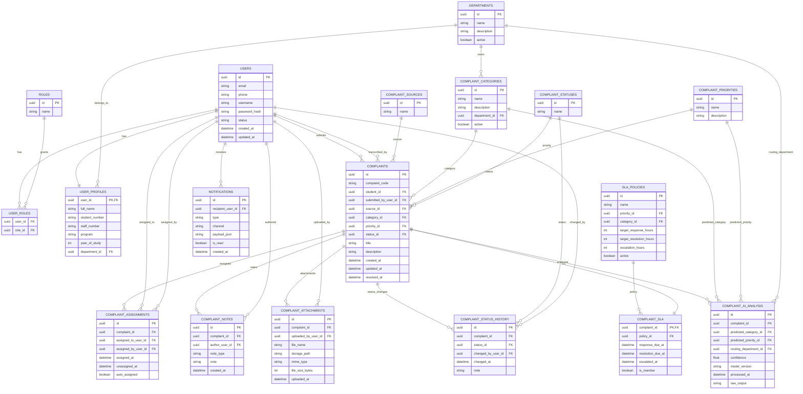

# Student Support System - ERD (Mermaid)

Below is a Mermaid ER diagram aligned to the draft data model. You can paste this into any Mermaid-compatible viewer.

```mermaid
erDiagram
    USERS {
        uuid id PK
        string email
        string phone
        string username
        string password_hash
        string status
        datetime created_at
        datetime updated_at
    }

    ROLES {
        uuid id PK
        string name
    }

    USER_ROLES {
        uuid user_id FK
        uuid role_id FK
    }

    USER_PROFILES {
        uuid user_id PK, FK
        string full_name
        string student_number
        string staff_number
        string program
        int year_of_study
        uuid department_id FK
    }

    DEPARTMENTS {
        uuid id PK
        string name
        string description
        boolean active
    }

    COMPLAINT_CATEGORIES {
        uuid id PK
        string name
        string description
        uuid department_id FK
        boolean active
    }

    COMPLAINT_SOURCES {
        uuid id PK
        string name
    }

    COMPLAINT_PRIORITIES {
        uuid id PK
        string name
        string description
    }

    COMPLAINT_STATUSES {
        uuid id PK
        string name
    }

    COMPLAINTS {
        uuid id PK
        string complaint_code
        uuid student_id FK
        uuid submitted_by_user_id FK
        uuid source_id FK
        uuid category_id FK
        uuid priority_id FK
        uuid status_id FK
        string title
        string description
        datetime created_at
        datetime updated_at
        datetime resolved_at
    }

    COMPLAINT_ASSIGNMENTS {
        uuid id PK
        uuid complaint_id FK
        uuid assigned_to_user_id FK
        uuid assigned_by_user_id FK
        datetime assigned_at
        datetime unassigned_at
        boolean auto_assigned
    }

    COMPLAINT_NOTES {
        uuid id PK
        uuid complaint_id FK
        uuid author_user_id FK
        string note_type
        string note
        datetime created_at
    }

    COMPLAINT_ATTACHMENTS {
        uuid id PK
        uuid complaint_id FK
        uuid uploaded_by_user_id FK
        string file_name
        string storage_path
        string mime_type
        int file_size_bytes
        datetime uploaded_at
    }

    COMPLAINT_STATUS_HISTORY {
        uuid id PK
        uuid complaint_id FK
        uuid status_id FK
        uuid changed_by_user_id FK
        datetime changed_at
        string note
    }

    SLA_POLICIES {
        uuid id PK
        string name
        uuid priority_id FK
        uuid category_id FK
        int target_response_hours
        int target_resolution_hours
        int escalation_hours
        boolean active
    }

    COMPLAINT_SLA {
        uuid complaint_id PK, FK
        uuid policy_id FK
        datetime response_due_at
        datetime resolution_due_at
        datetime escalated_at
        boolean is_overdue
    }

    NOTIFICATIONS {
        uuid id PK
        uuid recipient_user_id FK
        string type
        string channel
        string payload_json
        boolean is_read
        datetime created_at
    }

    COMPLAINT_AI_ANALYSIS {
        uuid id PK
        uuid complaint_id FK
        uuid predicted_category_id FK
        uuid predicted_priority_id FK
        uuid routing_department_id FK
        float confidence
        string model_version
        datetime processed_at
        string raw_output
    }

    USERS ||--o{ USER_ROLES : has
    ROLES ||--o{ USER_ROLES : grants

    USERS ||--|| USER_PROFILES : has
    DEPARTMENTS ||--o{ USER_PROFILES : belongs_to

    DEPARTMENTS ||--o{ COMPLAINT_CATEGORIES : owns

    USERS ||--o{ COMPLAINTS : submits
    USERS ||--o{ COMPLAINTS : transcribed_by

    COMPLAINT_SOURCES ||--o{ COMPLAINTS : source
    COMPLAINT_CATEGORIES ||--o{ COMPLAINTS : category
    COMPLAINT_PRIORITIES ||--o{ COMPLAINTS : priority
    COMPLAINT_STATUSES ||--o{ COMPLAINTS : status

    COMPLAINTS ||--o{ COMPLAINT_ASSIGNMENTS : assigned
    USERS ||--o{ COMPLAINT_ASSIGNMENTS : assigned_to
    USERS ||--o{ COMPLAINT_ASSIGNMENTS : assigned_by

    COMPLAINTS ||--o{ COMPLAINT_NOTES : notes
    USERS ||--o{ COMPLAINT_NOTES : authored

    COMPLAINTS ||--o{ COMPLAINT_ATTACHMENTS : attachments
    USERS ||--o{ COMPLAINT_ATTACHMENTS : uploaded_by

    COMPLAINTS ||--o{ COMPLAINT_STATUS_HISTORY : status_changes
    COMPLAINT_STATUSES ||--o{ COMPLAINT_STATUS_HISTORY : status
    USERS ||--o{ COMPLAINT_STATUS_HISTORY : changed_by

    SLA_POLICIES ||--o{ COMPLAINT_SLA : policy
    COMPLAINTS ||--|| COMPLAINT_SLA : sla

    USERS ||--o{ NOTIFICATIONS : receives

    COMPLAINTS ||--o{ COMPLAINT_AI_ANALYSIS : analyzed
    COMPLAINT_CATEGORIES ||--o{ COMPLAINT_AI_ANALYSIS : predicted_category
    COMPLAINT_PRIORITIES ||--o{ COMPLAINT_AI_ANALYSIS : predicted_priority
    DEPARTMENTS ||--o{ COMPLAINT_AI_ANALYSIS : routing_department
```
